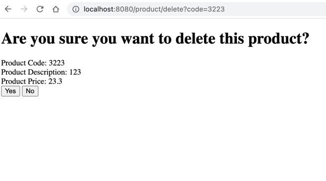

# Team 18 - TH 02
Sử dụng: 
1. Spring MVC
2. Spring data JPA
3. Lombok
4. Mysql connect
5. Devtools
6. Thymeleaf

Cách làm: 
1. Tạo model Product
2. Tạo interface ProductRepository connect tới CSDL (mysql)
3. Tạo class ProductController để điều hướng các chức năng
4. Tạo interface ProductService và impl của nó để thực hiện các chức năng
5. Giao diện sử dụng Thymeleaf để hiển thị dữ liệu

Phân chia công việc:  
     - Phạm Anh Tuấn: chức năng xem danh sách, thêm sản phẩm  
     - Nguyễn Văn Tuấn: chức năng sửa sản phẩm  
     - Đặng Trọng Hiếu: chức năng xóa sản phẩm  

Cấu trúc project  

Hiển thị giao diện
View all products:  

Add product:  

update product:  

Delete product:  

